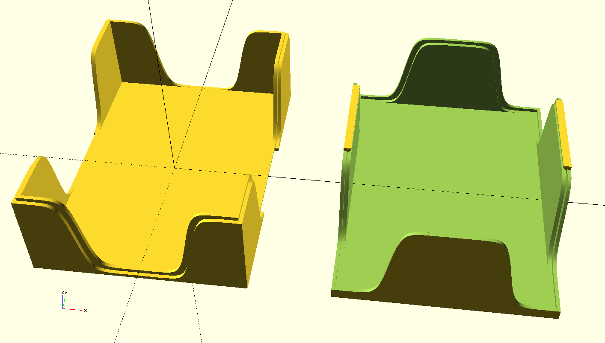

# Playing card box

Currently it fits regular playing cards inside protective sleeves.

Parameters:

 - `c_width` × `c_height` × `c_depth` - inner dimensions of the box
 - `c_wall1` - thickness of the inner part of side wall
 - `c_wall2` - thickness of the outer part of side wall (total side thickness is `c_wall1 + c_wall2`)
 - `c_bottom` - thickness of bottom and top cover
 - `top_clearance` - ammount of space taken away from the top part to ensure better fitting

Variants:
 - `part_mode`
   - `0`: full box
   - `1`: bottom part
   - `2`: top part
   - `99`: locking mechanism slice for debug
 - `locking_mechanism_mode_version`
   - `0`: easy to print, works ok-ish (recomended version)
   - `1`: theoretically better, more difficult to print, untested
